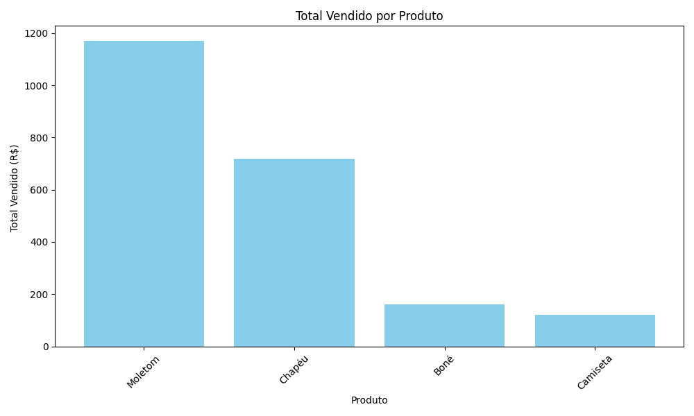

# Pipeline de dados simples com Python
Este projeto é um pipeline básico de dados feito com Python, focado em leitura de CSV, transformação, geração de relatórios e gráficos
## Estrutura
'''shell
$ tree 
├── README.md
├── dados
│   └── vendas.csv
├── database
│   └── vendas.db
├── main.py
├── relatorios
│   ├── grafico_total_por_produto.png
│   ├── quantidade_por_produto.csv
│   ├── relatorio.csv
│   ├── total_por_produto.csv
│   └── vendas_por_dia.csv
└── scripts
    ├── __pycache__
    │   ├── carregar.cpython-313.pyc
    │   ├── extrair.cpython-313.pyc
    │   ├── relatorio.cpython-313.pyc
    │   └── transformar.cpython-313.pyc
    ├── carregar.py
    ├── extrair.py
    ├── graficos.py
    ├── relatorio.py
    └── transformar.py
'''

## Funcionalidades

- Transformação de dados brutos
- Geração de relatórios em CSV
- Gráficos de análise com matplotlib
- Pipeline leve para treinar engenharia de dados

## Gráficos

## Requisitos

- Python 3.8+
- Pandas
- Matplotlib
- Sqlite3
